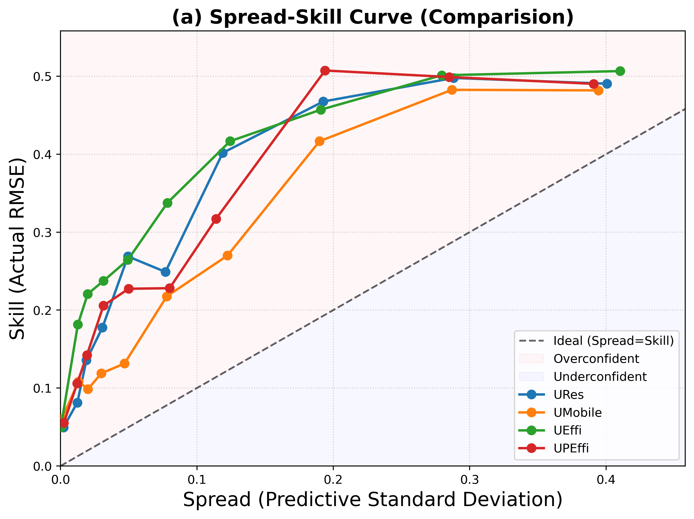

# Beyond Accuracy: Uncertainty Quality Assessment of Probabilistic U-Net Models for Flood Mapping

🚀 **Accepted at IEEE IGARSS 2026**

---

## 🌍 Introduction

Flood mapping from Synthetic Aperture Radar (SAR) imagery has become an essential tool for disaster response and environmental monitoring. While deep learning models—especially U-Net variants—have shown strong performance in segmentation tasks, most evaluations focus primarily on deterministic accuracy metrics such as F1-score or Intersection over Union (IoU).

However, in real-world decision-making systems, **knowing how confident a model is can be just as important as the prediction itself**.

This repository accompanies our IGARSS 2026 paper and focuses on **evaluating the quality of uncertainty estimates** produced by probabilistic deep learning models for flood mapping.

---

## 🧠 Motivation

Many segmentation models achieve similar accuracy scores, yet behave very differently when it comes to uncertainty estimation. Poorly calibrated uncertainty can lead to:

* Overconfident incorrect predictions
* Misleading reliability in high-risk scenarios
* Suboptimal model selection

This work demonstrates that:

> **Accuracy alone is not sufficient for selecting the best model in safety-critical applications.**

---

## ✨ Key Contributions

* A systematic evaluation of **uncertainty quality in probabilistic segmentation models**
* Implementation of **Monte Carlo Dropout** for uncertainty estimation
* Introduction and use of multiple **uncertainty evaluation metrics**, including:

  * Spread–Skill Reliability (SSREL)
  * Spread–Skill Ratio (SSRAT)
  * Mono-Fraction (MF)
  * Brier Score (BS)
* Comparative analysis of multiple U-Net architectures:

  * **ResNet-based U-Net** (best overall uncertainty behavior)
  * **MobileNet-based U-Net** (efficient alternative for resource-constrained settings)
* A modular **uncertainty quantification toolkit (`uqtools`)**

---

## 🏗️ Repository Structure

```
├── dataprocess.py        # Data preprocessing and preparation
├── etci_download.py      # Script to download the ETCI dataset
├── inference.ipynb       # Notebook for inference and visualization
├── models.py             # U-Net (Pre-trained) model implementations
├── train.py              # Training pipeline
├── utils.py              # Utility/helper functions
├── uqtools/              # Custom uncertainty quantification tools
```

---

## ⚙️ Installation

Clone the repository and install dependencies:

```bash
git clone https://github.com/YOUR_USERNAME/YOUR_REPO.git
cd YOUR_REPO
pip <please install the required packages>
```

### Requirements

* Python 3.8+
* PyTorch
* NumPy
* Matplotlib
* scikit-learn

---

## 📦 Dataset

This project uses the **ETCI dataset** for SAR-based flood mapping.

To download the dataset, run:

```bash
python etci_download.py
```

> ⚠️ Please ensure that you comply with the dataset's license and usage policies.

---

## 🚀 Training

To train a model:

```bash
python -u train.py --in_channels 4 --loss_type cedice --augmentation noaug --attention no --pretrain yes --dropout yes
```

### Example arguments:

* `--model`: Model backbone (e.g., `resnet_unet`, `mobilenet_unet`)
* `--dropout`: Dropout rate for Monte Carlo sampling

---

## 🔍 Inference and Visualization

Run inference and visualize predictions using the notebook:

```
inference.ipynb
```

This includes:

* Results prasented in the Paper
* Reliability and calibration analysis

---

## 📊 Uncertainty Quantification

We evaluate uncertainty using the following metrics:

* **SSREL (Spread–Skill Reliability)**
  Measures how well predicted uncertainty aligns with actual error

* **SSRAT (Spread–Skill Ratio)**
  Compares predicted uncertainty magnitude with observed error

* **Mono-Fraction (MF)**
  Evaluates monotonic relationship between uncertainty and error

* **Brier Score (BS)**
  Measures probabilistic prediction accuracy

These metrics provide insight into:

* Calibration quality
* Reliability
* Informativeness of uncertainty estimates

---

## 📈 Results and Insights

Our experiments show that:

* Multiple models achieve **similar F1-score and IoU**
* However, their **uncertainty behavior differs significantly**
* The **ResNet-based U-Net** provides the most balanced uncertainty estimates
* The **MobileNet-based U-Net** offers a strong trade-off between efficiency and performance

> 🔑 Key takeaway: **Model selection should consider uncertainty quality, not just accuracy.**

---

## 🖼️ Example Output

<p align="center">
  
</p>

---

## 📜 Citation

If you find this work useful, please cite:

```bibtex
@inproceedings{kalita2026beyond,
  title={Beyond Accuracy: Uncertainty Quality Assessment of Probabilistic U-Net Models for Flood Mapping},
  author={Kalita, Indrajit and Devi, Debashree},
  booktitle={IEEE International Geoscience and Remote Sensing Symposium (IGARSS)},
  year={2026}
}
```

---

## 📧 Contact

**Indrajit Kalita**
Boston University
📩 [indrajit@bu.edu](mailto:indrajit@bu.edu)

---

## 🙏 Acknowledgements

* Boston University
* IIIT Guwahati
* IEEE IGARSS Community

---

## 📄 License

This project is licensed under the MIT License (or specify your preferred license).

---

## ⭐ Final Note

If this repo reduced your uncertainty from “I have no idea” to “kinda makes sense”…
⭐ Star it. Cite it. Trust the posterior.

If your confidence > 0.95… we celebrate with coffee ☕.
